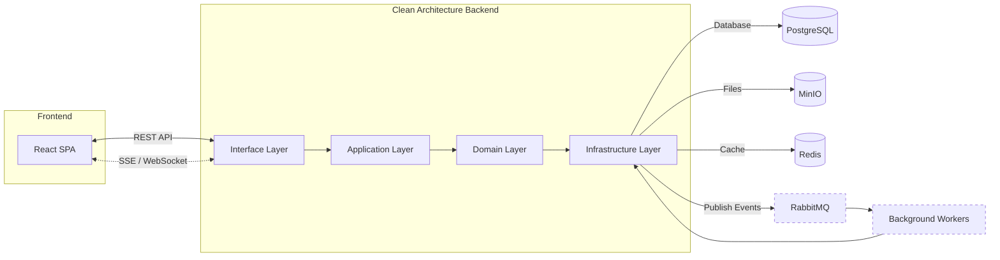

# CloudVault

A full-stack, multi-user cloud storage and sharing platform built with Spring Boot and React. Features personal workspaces (Projects), flexible sharing, real-time notifications, and event-driven architecture.

## Features

- **Multi-User & Secure Auth** - Registration, login, password reset; JWT authentication with refresh tokens.
- **Project Workspaces** - Isolated spaces to organize files and folders per project.
- **File & Folder Management** - Tree-like folder structure, upload with real-time progress (drag & drop), download files as zip, file preview (images, PDF, text).
- **Flexible Sharing** - Share entire projects, individual folders, or specific files with view/edit permissions. Public share links with optional password and expiration.
- **Real-Time Notifications** - Instant alerts for shares, new uploads, permission changes, deletions, and restores via Server-Sent Events (SSE) or WebSocket.
- **Versioning** - Automatic versioning when uploading a file with the same name; restore previous versions.
- **Trash & Recovery** - Soft delete moves items to trash, with restore or permanent delete capabilities.
- **Search** - Search files and folders by name across projects.
- **Caching & Performance** - Redis caching for frequently accessed metadata; event-driven background jobs (thumbnail generation, indexing) via RabbitMQ.
- **Scalable Storage** - Metadata in PostgreSQL, binary files in S3-compatible MinIO object storage.
- **Responsive UI** - Clean interface with dark/light mode support (Tailwind CSS + shadcn/ui).

## Tech Stack

### Backend
- Java 21, Spring Boot 3 (REST API)
- Spring Security + JWT (stateless auth)
- Spring Data JPA / Hibernate
- PostgreSQL (database)
- MinIO (object storage)
- Redis (caching)
- RabbitMQ (event bus)
- Swagger/OpenAPI (API docs)

### Frontend
- React 19 with Vite
- TypeScript
- Zustand (state management)
- TanStack Query (data fetching & caching)
- TanStack Router (routing)
- Tailwind CSS + shadcn/ui (UI components)

### DevOps & Tools
- Docker & Docker Compose 
- Environment-based configuration

## Architecture
The backend is built with **Clean Architecture** and **Domain-Driven Design (DDD)** principles. The codebase is organized into domain, application, infrastructure, and interface layers, so core business logic remains agnostic of frameworks and infrastructure. Metadata is persisted in PostgreSQL (with Redis caching for hot data), while binary files are stored in MinIO object storage. Domain events are published to RabbitMQ and handled asynchronously by background workers (thumbnail generation, search indexing, notifications). Real-time updates are streamed to the frontend via WebSocket or SSE.

