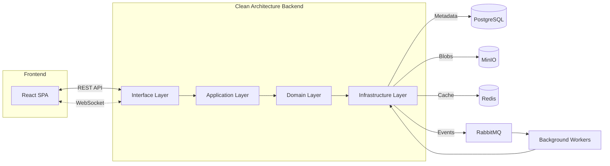

# CloudVault

CloudVault is a secure, high-performance, and personalized cloud storage and sharing platform. Built with a modern full-stack architecture, it enables users to manage their digital assets with the flexibility of a professional cloud drive.

## The Use Case: Why CloudVault?

In an era of digital collaboration, users often face a trade-off between simplicity and control. CloudVault was designed to solve several core challenges:

- **Isolated Workspaces**: Users need private, strictly isolated spaces (Projects) to organize personal and professional files without overlap.
- **Granular Sharing**: Collaboration shouldn't be "all or nothing." CloudVault allows sharing at the Project, Folder, or individual File level with specific permissions (View/Edit).
- **Real-Time Efficiency**: Modern workflows demand instant feedback. Whether it's an upload progress bar or a notification that a file was shared, CloudVault provides a "live" experience.
- **Data Integrity & Recovery**: Accidental deletions and overwrites happen. CloudVault integrates versioning and a robust trash system to ensure data is never truly lost unless intended.

## Key Features

- **Multi-User Security**: Secure registration, login (JWT), email verification, and password recovery.
- **Project-Centric Organization**: Create multiple Projects to isolate different workstreams.
- **Advanced File Management**: 
    - Tree-like folder structures.
    - Drag-and-drop uploads with real-time progress.
    - Recursive folder downloads (ZIP).
    - Automatic file versioning and restoration.
- **Flexible Collaboration**:
    - Share entire Projects, Folders, or individual Files.
    - Granular permissions (Viewer vs. Editor).
    - Public share links with optional password protection and expiration dates.
- **Real-Time Ecosystem**: Instant notifications for shares, uploads, and system updates via WebSockets.
- **Smart Search & History**: Global search across all projects and a detailed audit log (activity history).
- **Performance Optimized**: Cursor-based pagination for large datasets and Redis caching for hot metadata.

## Architecture

CloudVault is built on **Clean Architecture** and **Domain-Driven Design (DDD)** principles to ensure the system is scalable, maintainable, and framework-agnostic at its core.

### System Overview

- **Backend**: Organized into Domain, Application, Infrastructure, and Interface layers. Business logic is strictly decoupled from external libraries.
- **Storage Strategy**: Metadata (users, permissions, file structures) is stored in **PostgreSQL**, while binary file content is handled by **MinIO** (S3-compatible object storage).
- **Event-Driven Architecture**: Asynchronous tasks (like email delivery) are offloaded to **RabbitMQ** workers to keep the main request cycle fast.
- **Caching Layer**: **Redis** provides high-speed access to frequently requested metadata.

### System Flow


## Tech Stack

| Layer | Technologies |
| :--- | :--- |
| **Backend** | Java 21, Spring Boot 3, Spring Security (JWT), Spring Data JPA, Hibernate |
| **Frontend** | React 19, TypeScript, Vite, Tailwind CSS, shadcn/ui, Zustand, TanStack Query/Router |
| **Infrastructure** | PostgreSQL, MinIO, Redis, RabbitMQ |
| **Testing** | JUnit 5, Mockito, Testcontainers |
| **DevOps** | Docker, Docker Compose |

## Getting Started

### Prerequisites
- Java 21+
- Node.js 22+
- Docker & Docker Compose

### 1. Run Dependencies
Start the infrastructure services (Database, Storage, Cache, Broker):
```bash
docker compose -f dockers/deps/docker-compose.yaml up -d
```

### 2. Start Backend
```bash
cd backend
./mvnw spring-boot:run
```
The API will be available at `http://localhost:8080/api/v1`. Access Swagger docs at `/swagger-ui.html`.

### 3. Start Frontend
```bash
cd frontend
npm install
npm run dev
```
The UI will be available at `http://localhost:5173` (default Vite port).

## Docker Deployment

To run the entire stack (Frontend + Backend + Dependencies) using Docker:

```bash
cd dockers/apps
cp .env.example .env  # Configure your environment
docker compose up --build -d
```

Access the application at `http://localhost:3000`.

## License

This project is licensed under the **MIT License**. See the [LICENSE](LICENSE) file for details.

