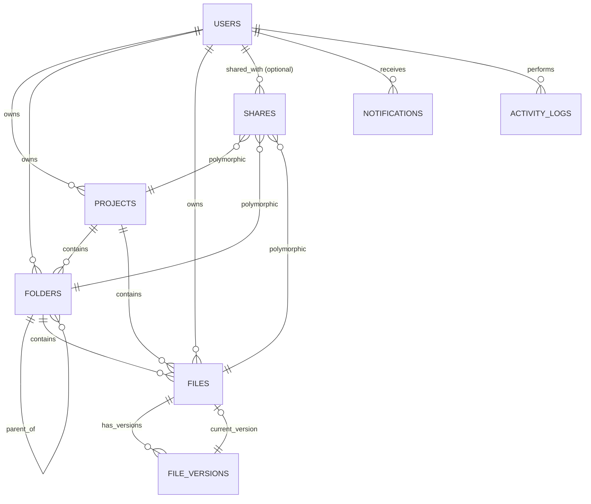

# Database Schema Design

This directory contains the detailed specifications for the CloudVault database schema.

## Entity-Relationship Diagram (ERD)

## Table Specifications

| Table | Description |
|-------|-------------|
| [01. Users](01-users.md) | User accounts and authentication. |
| [02. Projects](02-projects.md) | Top-level containers for storage. |
| [03. Folders](03-folders.md) | Hierarchical directory structure. |
| [04. Files](04-files.md) | Metadata and current version of files. |
| [05. File Versions](05-file-versions.md) | Historical versions of files. |
| [06. Shares](06-shares.md) | Access control for internal and **public link sharing**. |
| [07. Notifications](07-notifications.md) | User alerts and system messages. |
| [08. Activity Logs](08-activity-logs.md) | Audit trail of system interactions. |

## Key Design Principles

1.  **UUIDs**: Every primary key is a `UUID` generated by the database.
2.  **Timestamps**: `TIMESTAMPTZ` is used for all temporal data to ensure timezone consistency.
3.  **Soft Deletion**: `deleted_at` columns allow for a "Trash" feature across Projects, Folders, and Files.
4.  **Polymorphism**: The `shares` table uses a `resource_type` and `resource_id` pattern to share different entity types.
5.  **Public Access**: Support for anonymous link sharing via unique access tokens and optional passwords.
